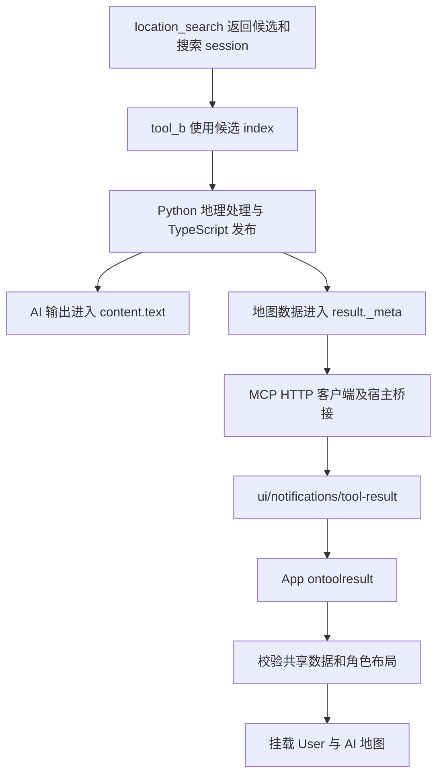

# GeoMCP MCP App 交付与宿主诊断交接

记录日期：2026-10-08，时间基准为 America/Toronto。面向后续接手的 Claude 或其他开发者。

本文记录当前代码、诊断运行方式、已执行的验证和剩余证据边界。它是开发交接材料，不取代 [GeoMCP 技术规范文档]。开始工作前先阅读仓库根目录的 `AGENTS.md` 和总体规范 §6.4、§10。

## 1. 当前结论与任务边界

针对本次 `app_map_metadata_missing` 故障，尚未发现 GeoMCP 自身的 metadata 组装或交付错误。项目发送侧已验证携带 `result._meta["io.geomcp/interactiveMap"]`；独立真实 HTTP 调用确认完整 metadata 可到达 MCP 客户端；实际 App 在模拟宿主完整转交结果时可通过 User／AI 数据校验。

新增真实宿主日志进一步表明：App 已启动并完成宿主握手，但在 App 的 `ontoolresult` 回调中，metadata keys 已为空，随后在 metadata 阶段失败。当前将这一现象记录为客户端／宿主转交兼容性问题；与公开 ChatGPT Web 问题是否同源，保持未确认。

用户已明确要求：专注验证项目自身的 `_meta` 交付，不继续追查宿主内部，也不因宿主兼容问题擅自给项目增加绕过逻辑。后续如用 Claude 诊断，应先收集同一次实际调用的发送和接收记录，再判断是否出现新的项目问题。

这项结论只覆盖本次 metadata 故障，不是对全部地图渲染、截图或客户端功能的无条件保证。

## 2. 接手时的工作区状态

编写本交接时，Git HEAD 为 `9be7e7c`。已有三份未提交源码改动，请保留并先检查磁盘内容和 diff：

| 文件 | 当前未提交改动 | 已存在的相关功能 |
|---|---|---|
| [src/index.ts](../../src/index.ts) | 注册临时 `geomcp_report_app_diagnostics`，把 App 事件写入后端 logger | 注册搜索、Tool A/B 和 App resource |
| [src/server/http/mcp-http-service.ts](../../src/server/http/mcp-http-service.ts) | initialize 日志补充 MCP session 和客户端 capabilities；协议错误补充错误名称与消息 | 记录请求、资源读取、工具发送结果摘要 |
| [mcp-app/interactive-map-launcher.ts](../../mcp-app/interactive-map-launcher.ts) | 前端事件通过宿主回传；增加 runtime、未处理 rejection 和 App 协议错误观察 | 本地诊断面板、宿主连接记录、metadata 校验、双地图、截图和工具状态记录 |

当前未提交源码 diff 是上述三文件，共 69 行新增、3 行删除。后续代码若有变化，以接手时 `git diff` 为准，不按本文覆盖用户修改。

本次交接只新增本文，没有修改源码、配置、依赖或测试。之前诊断改动未改变地理工具输入、Bridge 外层协议或地图 metadata 数据契约；新增了一个临时的、对 App 可见的后端工具。

仓库 `.gitignore` 忽略了 `/doc` 和 `/test`；本文、`test/log/` 中的日志及原始响应均为本地文件，没有强行加入 Git。仅 Git clone 不会带上这些交接材料，转移诊断环境时需要另外传递本文和日志。本文记录的是当前本机路径。

## 3. 地理工具结果与 App 的代码链路

### 3.1 职责和入口

TypeScript 负责 MCP、缓存、Bridge 编排和最终地图发布；Python 负责地理检索与处理。`python/main.py` 是 Bridge 解析和分发入口，具体 Tool B pipeline 在 `python/tools/tool_b.py`。此次诊断没有修改 Python。

主要阅读路径：

| 文件 | 作用 |
|---|---|
| [src/server/tools/tool-flow.ts](../../src/server/tools/tool-flow.ts) | 装配 `ai_output` 与独立的 `client_output` |
| [src/server/tools/mcp-tool-handler.ts](../../src/server/tools/mcp-tool-handler.ts) | 把 `client_output` 放到工具结果 `_meta`；把 `ai_output` 序列化为 text |
| [src/server/interactive-map-launcher-resource.ts](../../src/server/interactive-map-launcher-resource.ts) | 注册单文件 HTML resource 和资源 CSP |
| [src/models/web/map-app-models.ts](../../src/models/web/map-app-models.ts) | 共享地图数据、User／AI 布局及 App 工具输入输出模型 |
| [mcp-app/interactive-map-launcher.ts](../../mcp-app/interactive-map-launcher.ts) | 连接宿主、接收结果、校验 metadata、挂载地图和记录诊断 |
| [mcp-app/register-tools.ts](../../mcp-app/register-tools.ts) | 注册 App 内 AI 地图工具 |
| [mcp-app/ai-map-screenshot.ts](../../mcp-app/ai-map-screenshot.ts) | App 内 AI 地图截图实现 |
| [vite.launcher.config.ts](../../vite.launcher.config.ts) | 把 App 及配置、样式编译成单文件 HTML |

数据流如下：



### 3.2 Tool A/B 的实际返回契约

以下是形状说明，省略业务数据，不能作为真实响应或测试 fixture 使用：

```json
{
  "content": [{"type": "text", "text": "AI 输出的 JSON 字符串"}],
  "isError": false,
  "_meta": {
    "io.geomcp/interactiveMap": {
      "data": {"session_id": "最终地图 ID", "visual_output": "interactive"},
      "user_payload": {"map_size": [640, 480], "center": [0, 0], "leaflet_bbox": [[0, 0], [1, 1]], "url": "对应 session 的 Interactive URL"},
      "ai_payload": {"map_size": [640, 480], "center": [0, 0], "leaflet_bbox": [[0, 0], [1, 1]]}
    }
  }
}
```

`data` 实际还包括 basemap、render_mode、Overlay、Core、详情和索引等严格字段。`user_payload` 包含外部 Interactive 页面 URL；当前发布的 `ai_payload` 是独立布局，不包含后端 Snapshot URL。`visual_output=none` 时 `ai_payload=null`。

模型侧 JSON text 包含 `session_id`、权威 `bbox`、可选 `ai_output_yaml` 和可选 `overlay_output_json`。在保存的 Berczy Park 完整响应中，text 恰好只有前三项。模型只看见 text，不能由此断言原始 MCP 响应没有 `_meta`。

当前成功地理工具结果不附 `structuredContent` 或原生 image block。这是当前代码行为；`visual_output="screenshot"` 也不会使后端 Tool B 直接返回 image block。App 内部工具的成功结果可以包含 `structuredContent` 和图片，这是另一条路径。

### 3.3 Resource、通知和前端接收

Tool A/B 定义关联：

```json
{"_meta": {"ui": {"resourceUri": "ui://geomcp/interactive/map-launcher.html", "visibility": ["model"]}}}
```

Resource MIME type 为 `text/html;profile=mcp-app`。单文件 HTML 在注册时从 `dist/mcp-apps/interactive-map-launcher.html` 读取并保持冻结；配置和样式在构建时打包。资源返回的 `_meta.ui.csp` 声明后端 origin 的 `resourceDomains` 和 `connectDomains`。

宿主标准通知的 `params` 应是工具结果对象，App 接收回调直接读取 `result._meta["io.geomcp/interactiveMap"]`。缺失时立即报 `app_map_metadata_missing`，发生在 schema 校验、URL 校验和地图挂载之前。

App 从 metadata 创建地图，不靠访问 User URL、Session data route 或嵌套后端网页初始化。此前没有增加 `window.openai.toolResponseMetadata`、把地图搬进 text／structuredContent 或重新调用 Tool B 的 fallback。

## 4. App 工具和自动截图

当前代码在 App connect 前注册四个工具。这些工具属于宿主调用 App 的 RPC，不等于后端地理工具列表：

| 名称 | 输入 | 作用 |
|---|---|---|
| `geomcp_fit_ai_map_bbox` | `session_id` 与 `{south,west,north,east}` bbox | 调整 AI 地图并返回实际视口 |
| `geomcp_set_ai_map_center_zoom` | `session_id`、`center:{longitude,latitude}`、`zoom` | 修改 AI 地图中心和 zoom |
| `geomcp_capture_ai_map` | `session_id` | screenshot 模式获取当前 AI 地图图片与实际 bbox |
| `geomcp_fit_ai_map_to_user_view` | `session_id` | 读取 User 当前可见 bbox 并调整 AI 地图 |

初始工具禁用，等 ready 绑定后启用；`geomcp_capture_ai_map` 仅 screenshot 模式启用，User 对齐工具还需要同 session 的 User ready 绑定。metadata 失败时地图未创建，工具保持禁用。日志没有工具列表请求，不能单凭这一点推导宿主完全不支持 App 工具。

screenshot 模式的首图由 App 生成，然后调用 `app.updateModelContext()`；相关日志为 `ai_screenshot_started`、`ai_screenshot_created`／`ai_screenshot_failed`、`model_context_submission_started` 和 `model_context_acknowledged`／`model_context_submission_failed`。ACK 仅说明宿主确认接收，不证明当前模型回合实际收到图片。

本次真实 metadata 故障没有进入上述路径，因此不能从本次日志单独判断截图实现或图片提交功能是否有问题。

## 5. 临时诊断回传实现

### 5.1 回传路径

```text
App recordDiagnostic
  → 本地诊断面板与 console
  → app.callServerTool("geomcp_report_app_diagnostics")
  → 宿主 MCP 代理
  → 后端 logger.info / logger.warning
  → Linux terminal 和 tee 保存的日志
```

无需 Chrome DevTools，也不需要 iframe 向后端发额外的跨域诊断 HTTP 请求。只回传当前 App 的观测事件，不提供宿主内部日志。

每个 App 实例生成一个 `app_instance_id`。事件格式如下：

```json
{
  "app_instance_id": "某个 App 实例 ID",
  "entries": [{"time": "2026-10-08T04:52:52.692Z", "level": "INFO", "event": "host_tool_result_received", "details": {"revision": 1, "metadata_keys": []}}]
}
```

后端采用严格 Zod 输入模型：实例 ID 和 event 最大 100 字符；time 为 ISO datetime；level 仅 INFO／WARNING；details 为 JSON 或 null；每批 1～16 条。ACK 是 text `{"accepted":N}`。

该工具 `_meta.ui.visibility=["app"]`，不关联 resourceUri，按设计不进入模型可见工具列表，也不触发地图 UI。底层 MCP `tools/list` 是否显示 app-only 定义，取决于客户端的可见性处理；不要把后端原有三个地理工具与这个临时入口混为一谈。

前端缓存最近 100 条事件并串行发送，每批最多 16 条、超时 5 秒。握手前事件先缓存，连接成功且宿主声明 `serverTools` 后发送。回传失败后停止发送、清空待发送队列并本地记录 `diagnostic_report_failed`，不自动重试或递归报告通道错误。

如果脚本未执行、握手失败或宿主没有 `serverTools`，后端可能收不到前端记录。诊断区仍保留已执行到的本地事件，可尝试“复制诊断”；Clipboard 失败可手动选取。`diagnostic_reporting_unavailable` 是 INFO，避免普通能力缺失自动展开面板干扰地图操作。

### 5.2 应重点查看的事件

| 事件 | 判断依据 |
|---|---|
| `mcp_client_initialize` | 实际 clientInfo、协议版本、capabilities 和 MCP session |
| `mcp_diagnostic_request` | method、request ID、tool name 或 resource URI |
| `mcp_diagnostic_tool_result_sent` | 发送侧 isError、metadata keys、地图 ID |
| `mcp_diagnostic_response_error`／`mcp_session_protocol_error` | 协议响应或连接错误，后者包含错误名称与消息 |
| `app_started` → `host_connection_started` → `host_connected` | App 启动及握手进展 |
| `host_tool_result_received` | App 回调所见 metadata keys、content types、revision |
| `user_delivery_validated`／`ai_delivery_validated` | 数据与布局通过校验 |
| `maps_mount_requested` | 请求挂载；不等于渲染已经完成 |
| `user_map_ready`／`ai_map_ready` | 对应地图 ready |
| `app_map_delivery_failed` | metadata／布局／URL 等阶段和具体错误 |
| `host_tools_list_requested`／`app_tools_list_returned` | 宿主真实询问 App 列表及 App 返回的名称 |
| `ai_tools_disabled`／`ai_tools_state` | 当前工具状态 |
| `app_runtime_error`／`app_unhandled_rejection`／`app_protocol_error` | JS、异步和 SDK 协议错误 |

后端工具摘要在 `await transport.send(...)` 返回后记录，说明传入发送路径的结果包含 metadata，不是逐字节 HTTP 抓包或宿主接收确认。需要证明某轮原始 HTTP 内容时，要额外保存那一轮的完整响应。

## 6. Linux 启动、调用与日志保存

以下命令从仓库根目录执行，使用项目已有 Node 依赖和 `.venv`，无需全局安装依赖。当前部署配置为 `config/web.yaml` 中的 `http://127.0.0.1:23336`，MCP endpoint 是 `http://127.0.0.1:23336/mcp`。

### 6.1 构建与启动

修改 App TypeScript、构建期配置或样式后先构建。`npm run dev` 运行的是后端，不会自动重建单文件 App：

```bash
npm run build:web
mkdir -p test/log
GEOMCP_LOG_LEVEL=INFO npm run dev 2>&1 | tee "test/log/host-$(date +%Y%m%d-%H%M%S).log"
```

仅重建 launcher 时可用 `npx --no-install vite build --config vite.launcher.config.ts`。重新构建后还要重启后端并让宿主加载新 App 实例，因为 resource HTML 在后端注册时已经读入内存。旧 iframe 也不会自动换成新代码。

默认情况下 INFO 不输出，所以必须带 `GEOMCP_LOG_LEVEL=INFO`。Node 日志写 stdout，MCP 响应经 HTTP；Python stdout 保持 Bridge JSON，Python logger 写 stderr，后端收集后转发。后端 Python 日志可能在子进程结束后才成批出现。

生产编译运行可分别使用 `npm run build` 和 `GEOMCP_LOG_LEVEL=INFO npm start`，仍需已有的 web／App 构建产物。不要同时启动两个进程占用 23336。`PYTHON_PATH` 可显式指定项目解释器；没有设置时 Bridge 优先选择仓库 `.venv/bin/python`。

### 6.2 真实客户端调用顺序

在 Claude 或 Codex 中连接实际可访问的上述 MCP endpoint，然后执行：

1. `location_search` 查找目标地点，保留实际返回的搜索 `session_id` 和候选 `index`。
2. `tool_b` 使用该 session 和候选 index；不能拿旧进程缓存中的搜索 ID 直接调用新进程。
3. 等待 App 展示和诊断回传，再检查同一次调用的完整日志。

示例参数，必须替换搜索 session 与候选 index：

```json
{"queries": [{"query": "Berczy Park, Toronto", "country_codes": ["CA"]}]}
```

```json
{
  "session_id": "本轮 location_search 返回的 ID",
  "selected_indices": [1],
  "basemap": "osm",
  "visual_output": "interactive",
  "attention_experts": ["outdoor"],
  "include_overlay_geojson": false
}
```

先用 interactive 验证 metadata 和 App 接收；要检查首图提交再单独用 screenshot。本地地址只适用于能访问该机器 loopback 的客户端，远端环境需要使用实际部署地址。

### 6.3 已有可见浏览器调试入口

另开终端运行已有场景脚本，它直接运行，不用 `node --test`：

```bash
node --import tsx test/tool-flow/tool-flow-call.test.ts
```

该脚本使用真实 SDK 连接后端、搜索候选、调用地理工具、读取 App HTML，再由自建宿主在 Chromium iframe 中转交原始 Tool Result。编写本文时脚本默认地点为 Apple Park／US，Tool B、screenshot、osm、amusement、includeOverlayGeojson=true；不要把它的默认场景误认成之前 Berczy Park 测试。

脚本支持 `GEOMCP_MCP_URL` 指定 endpoint；远程部署若需要 Bearer token，可通过已有 `GEOMCP_MCP_BEARER_TOKEN` 环境变量配置，不要将 token 写入日志或文档。

终端命令：

```text
tools
fit
fit <south> <west> <north> <east>
set <longitude> <latitude> <zoom>
q
```

`tools` 查看 App 列表；fit／set 操作 AI 地图；screenshot 模式的新图在 iframe 下方解码显示。`q` 关闭调试客户端与浏览器，不关闭后端。它需要可见图形环境（`headless:false`）；无桌面 Linux 可先用下述已有自动回归测试。

这个调试宿主目前只声明 `openLinks`、`updateModelContext`，没有声明 `serverTools`，所以 App 可能记录 `diagnostic_reporting_unavailable`，不会经临时工具回传。这不妨碍该脚本观察页面 warning/error、截图和 RPC。它与下面完整／去 metadata 的关联探针是不同的测试宿主。

脚本会校验 metadata 并打印布局，但不自动保存完整 raw HTTP／MCP envelope。需要完整结果时，应保存 SDK 原始 `callTool()` 结果，并同时捕获底层 HTTP body；不能用打印出来的 `Tool call reply` 代替完整返回。

### 6.4 读取和筛选证据

真实记录目前在 `test/log/host.log`，不是模拟目录里的 `backend.jsonl`：

```bash
rg -n 'mcp_client_initialize|mcp_diagnostic_tool_result_sent|mcp_app_diagnostic|resources/read|WARNING|ERROR' test/log/host.log
rg -n 'ea68f6c9-abce-4375-ae4a-5a862cebabfc|muz28xr4-rn7oxrd7ho' test/log/host.log
```

后端通过 MCP session + request ID 区分调用；App 通过 app_instance_id + revision 区分实例和结果代次。诊断回传走同一个 MCP session，可把两侧记录串起来。但收到缺失 metadata 的通知时，现有摘要没有地图 ID 或工具名，不能逐字节验证该通知就是某份具体 envelope。

App 的 `app_time` 是 UTC ISO 时间；后端 `ts` 是本次本地时间，例如 `04:52:52Z` 对应 Toronto `00:52:52`。诊断按批回传，后端写入时间会比 App 事件时间晚；不能据行顺序反推异步事件发生顺序。

## 7. 已保存证据及各自能证明什么

### 7.1 本地真实后端 + 模拟宿主，2026-10-08 00:44～00:45

目录：[test/log/run-2026-10-08T04-44-29-478Z/](../../test/log/run-2026-10-08T04-44-29-478Z/)。目录名称的时间是 UTC。

| 文件 | 内容 |
|---|---|
| `backend.jsonl` | 后端完整运行和 App 回传事件 |
| `backend-stderr.txt` | 此次单独保存的 stderr，为空 |
| `tool-b-request.json` | 本次实际 Tool B JSON-RPC 请求 |
| `tool-b-http-body.txt` | 完整原始 HTTP SSE body，约 6.0 MiB |
| `tool-b-envelope.json` | 从原始响应提取并格式化的完整 JSON-RPC envelope，约 13.6 MiB |
| `app-full.jsonl` | 完整转交结果的 App 事件 |
| `app-stripped.jsonl` | 故意移除 `_meta` 后的 App 事件 |
| `comparison.json` | 检查结果、关联 ID 和明确测试范围 |

测试真实调用 Nominatim、Overpass、MCP 和 Tool B；只有浏览器底图图片用本地 PNG fixture 隔离网络。不是对真实在线底图显示的全面验证。

- 客户端：`geomcp-host-correlation-probe / 1.0.0`。
- MCP session：`de22f073-c7e1-4d4c-a8de-885a94a6800d`；Tool B request ID：3。
- 地点：Berczy Park, Toronto；地图 session：`260764c090f-1`；模式：interactive。
- 原始 HTTP metadata 与 SDK 所见 metadata 深度一致，地图 schema 校验通过。
- 完整宿主 App：`muz1zbpk-iykj8l1m2ad`，通过 User／AI 校验并记录 `maps_mount_requested`。
- 去 metadata 宿主 App：`muz1zd58-yrzmsv6s0vd`，握手成功后复现 `app_map_metadata_missing`。

这份关联探针是临时执行的内联脚本，没有新增一个可长期重跑的同名测试文件。保留的是执行结果。已有可重跑入口见 §6.3 和 §9。

模拟测试证明完整 metadata 可被实际 App 接收、解析，并且移除 metadata 足以复现错误。它不是实际 Codex／Claude 的宿主实现；日志到 `maps_mount_requested` 为止，也不表示已经证明全部地图 ready、全部 App 工具可调用或模型收到图片。

### 7.2 新增真实宿主记录，2026-10-08 00:51～00:53

文件：[test/log/host.log](../../test/log/host.log)，编写本文时共 77 行。

| 标识 | 实际值 |
|---|---|
| MCP 客户端 | `codex-mcp-client`，title Codex，version `0.160.1` |
| 实际 UI 路径 MCP session | `ea68f6c9-abce-4375-ae4a-5a862cebabfc` |
| 协议版本 | `2025-06-18` |
| 工具 | `tool_b`，request ID 3 |
| 地点 | 搜索记录为 Cloud Gardens, Toronto, Ontario, Canada |
| 后端发送的地图 session | `260f517ef46-1` |
| App 实例 | `muz28xr4-rn7oxrd7ho` |
| UI 宿主自报信息 | `chatgpt / 26.930.61225` |

关键链路：

| 日志行 | 事件与证据 |
|---|---|
| 27 | 实际客户端 capabilities 含 `extensions.io.modelcontextprotocol/ui`，声明 App MIME types；同文件其他连接只有 elicitation，不能混用 |
| 34～35 | 同 session 请求并收到 launcher resource |
| 54 | Tool B 发送摘要：`is_error=false`，metadata keys 包含地图 key，has_interactive_map_data=true |
| 56～58 | App 启动并成功连接 UI 宿主 |
| 61 | App 收到 revision 1：`metadata_keys=[]`，has_interactive_map_data=false，仅 text，无 structuredContent |
| 62～64 | AI 工具禁用，随后 stage=metadata、code=app_map_metadata_missing |

后端发送有地图 key，App 回调没有地图 key；当前故障范围已收敛到结果转交路径。App 的 iframe 脚本执行和宿主握手已经有证据，不能再写“App 是否加载尚无可观察证据”。

本次没有保存原始 HTTP body，发送摘要也不包含完整 payload；不要把 §7.1 的 Berczy Park 原始响应拿来冒充这次 Cloud Gardens 的实际响应。现有记录支持项目发送侧通过、转交异常，但没有定位宿主内部具体丢失层。

App 事件发生在 `04:52:52Z`，诊断工具请求／ACK 记录在 `00:52:54`。因此不能把诊断工具 ACK 的空 metadata 当成本次地图结果，也没有证据说明诊断 ACK 导致了最初那条 metadata 错误。

### 7.3 旧 Claude 记录，2026-10-07

文件：[message.txt](message.txt) 和 [222.txt](222.txt)。

`222.txt` 记录实际 clientInfo 为 `claude-code`，版本分别为 `2.1.284` 和 `2.1.293`，协议 `2025-11-25`。两次 Tool B 均发送成功，并包含地图 key，地图 session 为 `260d68baa54-1`：

- MCP session `9593f95e-542c-4749-a411-48726ba848f9`，request ID 4，约 20:20:00。
- MCP session `4183691d-a024-42ed-a681-8b3e2a251d6d`，request ID 3，约 20:21:51。

旧记录只有资源列表相关操作，没有 launcher `resources/read` 和对应 App 握手／接收证据。因此只能确认后端发送 metadata；不能确认 Claude iframe 加载成功、实际收到 metadata 或在初始化期间出错，也不能仅凭 clientInfo 把 Claude Code 与 Claude Desktop 视为同一环境。

`message.txt` 所称“原始结果只有三个字段”是聊天中展示的 AI JSON，不是保留完整 MCP envelope 的抓包。不要据此得出 `_meta` 未发送的结论。

### 7.4 更早的记录

Windows 上曾保存旧地图 session `260a10cb6e0-1` 的完整后端 HTTP 返回；另一次原生调用 `26007c36408-1` 只保存了模型可见结果，没有原始 HTTP 和实际 App 通知 params。它们不能互相替代。

此前的 `Cannot find module ... browser-service.mjs` 和 `CUA_REPL_ENABLED_SURFACES is required` 属于另一轮浏览器接口初始化尝试，不是已成功的原生 Tool B 返回原因。不要把这些历史错误重新归因给当前 metadata 故障。

## 8. 问题归类、外部报告与规范差异

| 项目 | 当前判断 |
|---|---|
| 后端漏装地图 `_meta` | 当前代码和已执行测试未发现 |
| 完整地图数据无法被 App 解析 | 完整模拟转交测试通过；未发现同类项目错误 |
| 真实宿主未加载 App | 新日志已经排除这一说法，App 启动和握手成功 |
| 真实 App 回调缺少地图 metadata | 已实际观察 |
| 四个 App 工具未出现／模型没有图片 | 本次流程在 metadata 阶段停止；不能独立归因于工具注册或截图实现 |
| `skip_overlay_geometry`，way 34587823，empty_after_bbox_clip | 单条几何裁切后为空的跳过 warning；随后 Tool B 成功，不能解释整个 `_meta` 消失 |
| host_connected 的 sandbox CSP 域名数组为空 | 观察到的宿主能力摘要；本次尚未进入地图请求阶段，不能据此认定为当前故障原因 |
| 旧 Claude 没有 iframe | 缺少 App 侧证据，尚未定位 |

用户提供过公开报告摘要，提及 GitHub Issue #231、ChatGPT Web metadata 丢失，以及 Web／Desktop／App 主动 tools/call 的差异。当前没有在本文中重新查询这些报告，也没有完整精确链接；摘要只能作为用户提供的外部背景，不可写成 `26.930.61225` 已被公开确认的同版本 bug。Issue open 状态、某个 Desktop 测试成功，都不能代替本次实际日志。

如以后确需核查协议背景，可阅读 [MCP Apps specification](https://github.com/modelcontextprotocol/ext-apps/blob/main/specification/draft/apps.mdx) 和 [OpenAI Plugins reference](https://developers.openai.com/plugins/reference)。本任务不要求继续追查宿主内部，也不要求添加厂商专用兼容分支。

规范与当前实现存在已知差异，保持报告，不自行修订权威文档：

- 总体规范 §6.4 仍描述两个 App 工具和没有当前视口截图工具，实际代码为四个工具并包含截图。
- 规范描述 AI-facing 视觉 URL，实际当前 `tool-flow.ts` 不在 AI text 发布视觉 URL，AI layout 也没有 URL。
- §10 描述独立 App warning 留在宿主，当前按用户明确授权临时增加经 MCP 工具回传 terminal 的诊断通道。

本文解释实际代码状态，不把这些差异变成新的架构授权。

## 9. 验证记录与可重跑的相关检查

之前诊断代码修改后已执行并通过：TypeScript 后端和 web typecheck、后端 build、launcher build、logger／handler／resource 检查、HTTP 相关两项、App browser 五项和 AI map 二十项。最初诊断能力缺失使用 WARNING 时曾使诊断面板展开并干扰测量点击；已改为 INFO，并重跑 browser 五项通过。

还执行过临时真实后端＋Chromium 诊断检查：前端事件缓冲／回传、metadata 缺失、runtime／rejection warning、输入校验、回传失败停止发送，以及协议错误原因保存。没有因此新增测试文件。§7.1 的 raw HTTP 与两个宿主关联测试通过，并已关闭该次临时服务。

这些是此前执行记录。本次编写文档没有重跑业务测试，不声称新一轮 Claude 或真实宿主图片验证成功。

后续需要重跑时可选择直接相关检查：

```bash
npm run typecheck
npm run typecheck:web
```

它是已有自动测试，和 §7.1 的临时关联探针不同；本文未新建或修改该测试。浏览器测试使用项目已有 Playwright／Chromium 环境，不安装全局依赖。遇到执行环境禁止监听端口或启动 Chromium，应报告执行限制，不把限制当成代码失败，也不改断言绕过。

## 10. Claude 接手后的最小诊断流程

1. 先阅读本文、`AGENTS.md` 和总体规范，执行 `git status --short`、`git diff`，保留已有三份源码修改。
2. 确认测试对象是 Claude Code、Claude Desktop 还是其他 UI；从本轮 initialize 的 clientInfo 和 App host_connected 分别记录身份，不使用另一个 CLI 版本替代。
3. 使用 §6.1 的 INFO 启动方式，给新一轮日志独立文件名；必要时重建 App 并重新加载宿主实例。
4. 本轮搜索后再调用 Tool B，记录实际请求参数、搜索和地图 ID、MCP session 和 request ID。
5. 检查同一 session 的 Tool B 发送摘要是否含地图 metadata。如需严格 HTTP 交付证明，再保存本轮完整 HTTP body 与 SDK 结果。
6. 查看 launcher resource 是否读取，再看同一 App 的启动、握手和接收事件。没有 App 事件时先说明观测缺口，不能直接写“Claude 丢失 metadata”。resource 可能有缓存，缺少一次读取也不能单独证明未加载。
7. 若完整 metadata 到达，继续检查 User／AI 校验、ready、工具列表和 screenshot 提交；只有这时出现的具体项目错误才进入下一轮修复讨论。
8. 若发送侧有 metadata、App 接收侧没有，按现有结论记录宿主转交异常，停止扩大追查；不要自行增加 metadata fallback 或把大地图数据注入模型 text。

接手报告应明确分开：实际观察、测试结论、未验证假设。尤其不能把 `isError=false`、`resources/read` 成功、`maps_mount_requested` 或 model context ACK 单独当成完整端到端成功。
